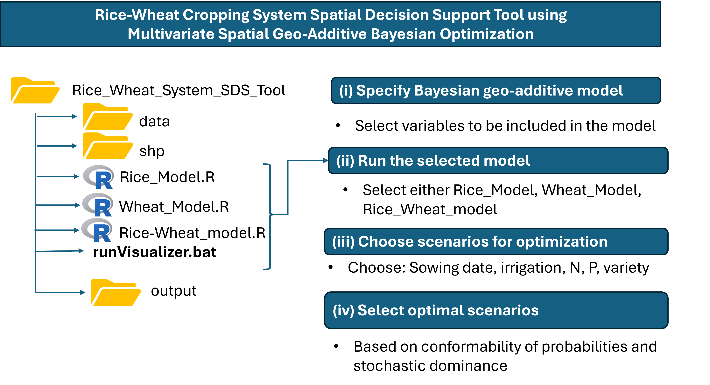
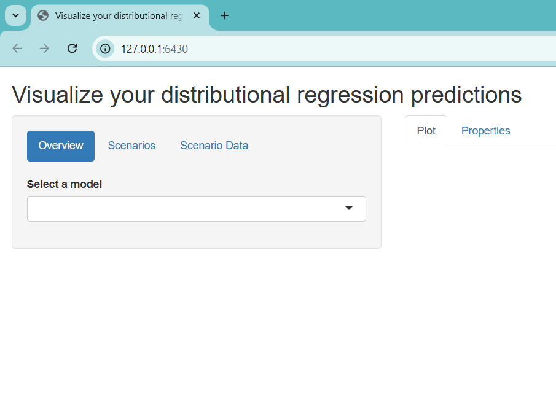

# Rice-Wheat Cropping System Spatial Decision Support Tool using Multivariate Spatial Geo-Additive Bayesian Optimization

## Summary
We showcase a rice-wheat system spatial decision support tool that allows researchers and decision makers to explore the implications of changing different components of the system inputs. The tool relies on a multivariate spatial geo-additive Bayesian model.

## Installation
To use the tool, you need to have R studio (or Visual Studio Code). You can download this repository or clone it. Then, you need to open the R studio project. If using Visual Studio Code, you can simply open the folder.

In the folder, there two important sets of R scripts. The first set of scripts implement the different geo-additive models. The second set of scripts source the main code and activates the tool.

## The visualization tool

The consists of folders for data, shapefiles (shp) and outputs. It consists of the .bat file for launching the analysis and R scripts (Rice_Model.R, Wheat_Model.R and Rice_Wheat_Model.R) that have the respective Bayesian geoadditive model specifications. To lauch the rice model, double click on the runVisualizer.bat. For the wheat and system model, one can edit the .bat by commenting out the rice model and instead de-comment the other preferred model. If one wants to change the variables in the model, they can change the variables included in each of the respective R scripts. 

After running the .bat file. Wait for some minutes, then enter following R code:

**library(distreg.vis)**

**library(bamlss)**

**if (interactive()) {distreg.vis::vis()}**

This will produce the tool below: 

One can also run the tool by just running the respective R code (i.e., Rice_Model.R, Wheat_Model.R and Rice_Wheat_Model.R). 

### Mimicking Bayesian Optimization Experiment in Optimizing Rice-Wheat Cropping System
The toolkit as it is does not optimize the system, it allows one to conduct scenario analyses including those that are suboptimal. We demonstrate how one can run multiple combinations that give the lower and upper
bounds of an optimization process. This exercise then allows one to use the visualization tool as akin to process optimization using Bayesian methods and Bayesian optimization. 

#### Step 1: Choose the goals for the rice and wheat system
This involves choosing either yield or revenue goals for which probabilities will be calculated. 

#### Step 2: Select the design space for the optimization by choosing lower bounds and upper bounds of combinations of variables given agronomy knowledge
This involves choosing N, irrigations, sowing date and varieties. Order the results based on probabilities of conformability, that is giving the highest probability of attaining the goals for the rice and wheat 
cropping systems.

Iterate by adjusting the optimal amounts in the direction of optimality while holding other variables at optimal amounts and check if the probabilities of conformability change. 

## Conclusion

The current version of the visualization tool allows crop specific visualizer. For results on system level analytics, the reader is refered to Mkondiwa et al 2025 (https://papers.ssrn.com/sol3/papers.cfm?abstract_id=5309835).

## References 

For similar applications, see an Agent Based Model visualizer by Harrison Smith, Meha Jain, Maanya Umashaanker, and Sukhwinder Singh (https://www.learngala.com/cases/growing-into-an-uncertain-future/)

